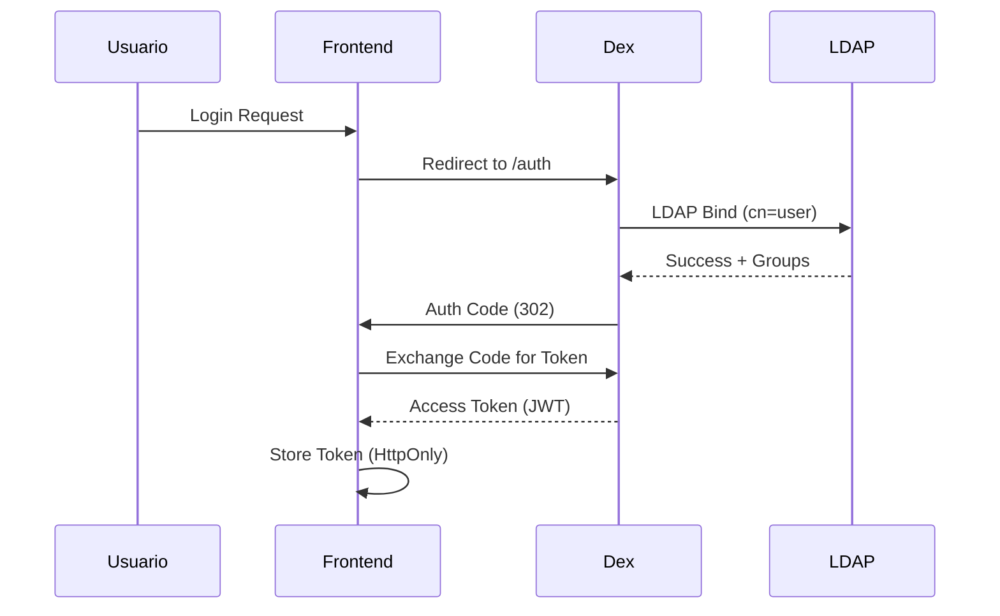

```mermaid
sequenceDiagram
    participant U as Usuario
    participant Fr as Frontend
    participant D as Dex
    participant L as LDAP

    U->>Fr: Login Request
    Fr->>D: Redirect to /auth
    D->>L: LDAP Bind (cn=user)
    L-->>D: Success + Groups
    D->>Fr: Auth Code (302)
    Fr->>D: Exchange Code for Token
    D-->>Fr: Access Token (JWT)
    Fr->>Fr: Store Token (HttpOnly)
```