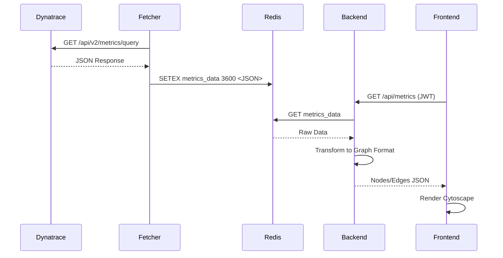

```mermaid
sequenceDiagram
    participant D as Dynatrace
    participant F as Fetcher
    participant R as Redis
    participant B as Backend
    participant Fr as Frontend

    F->>D: GET /api/v2/metrics/query
    D-->>F: JSON Response
    F->>R: SETEX metrics_data 3600 <JSON>
    Fr->>B: GET /api/metrics (JWT)
    B->>R: GET metrics_data
    R-->>B: Raw Data
    B->>B: Transform to Graph Format
    B-->>Fr: Nodes/Edges JSON
    Fr->>Fr: Render Cytoscape
```